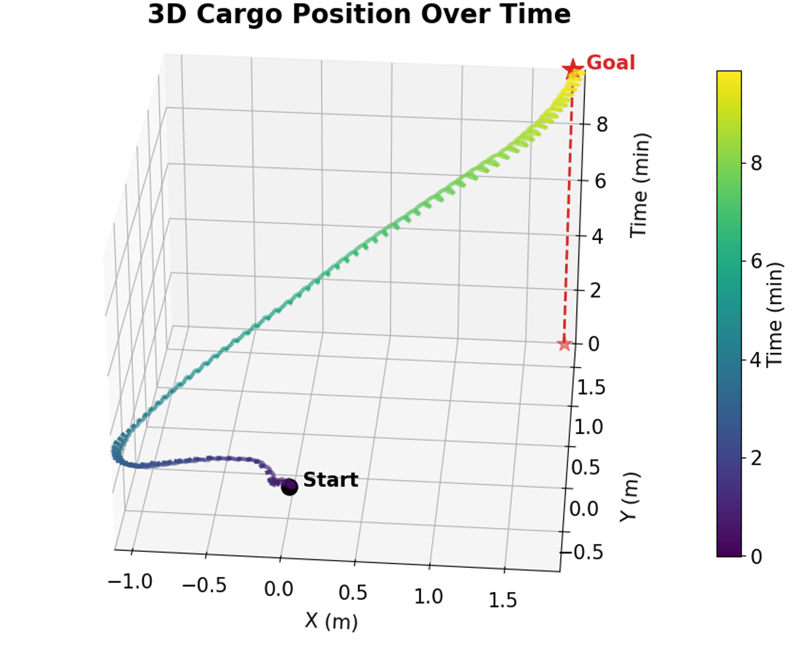
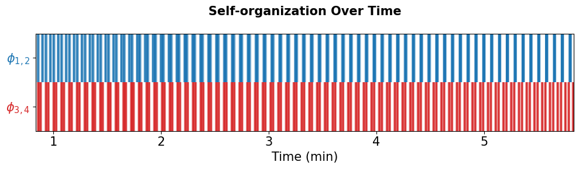

# Tug of War: 
# How Adversarial Robots Lead to Emergence Cooperation

Arthicha Srisuchinnawong (zumoarthicha@gmail.com)

Simulating an array of tethered oscillators as a competitive tug of robots.

## Requirements (tested platform)

- Python 3.12
- python standard modules (numpy, matplotlib, etc)
- CoppeliaSim V4.4 [download](https://www.coppeliarobotics.com/)

## Running the Experiment Yourself

1. Open Coppelia scene `tortel_cargoexp.ttt`

2. In cargo's child scrpt, set EXTERNAL_FILE_PATH to "simtransport.py". For example, "D:\myname\projectname\simtransport.py"

3. Run (>) in the CoppeliaSim. CoppeliaSim will automatically run simtransport.py for you.

4. Enjoy!

## Demo1: Toward a Goal

  
  

## Configure the Program

In "simtransport.py", there are 2 configuration argument you can play. 

<item> SCHEME: control scheme, either "centralized" (standart kuramoto coupling enforcing phase offset) vs "decentralized" (implecit coupling via force feedback).

<item> DIRECTION: target moving direction. 1 toward the blue team, -1 toward the red team.

For example, when (SCEME,DIRECTION) = ("centralized",1) the robot collective will moves toward the right (blue team) using explicit kuramoto coupling. When (SCEME,DIRECTION) = ("decentralized",-1), the robot collective will move toward the left (red team) using implecit coupling without any explicit communication between robots.