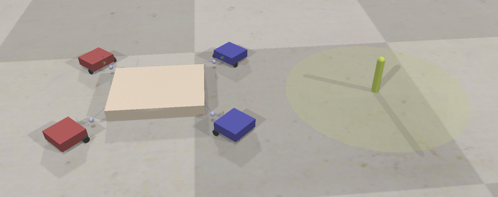
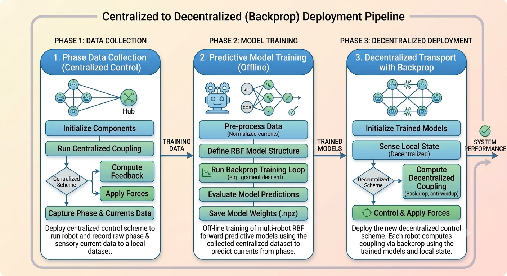
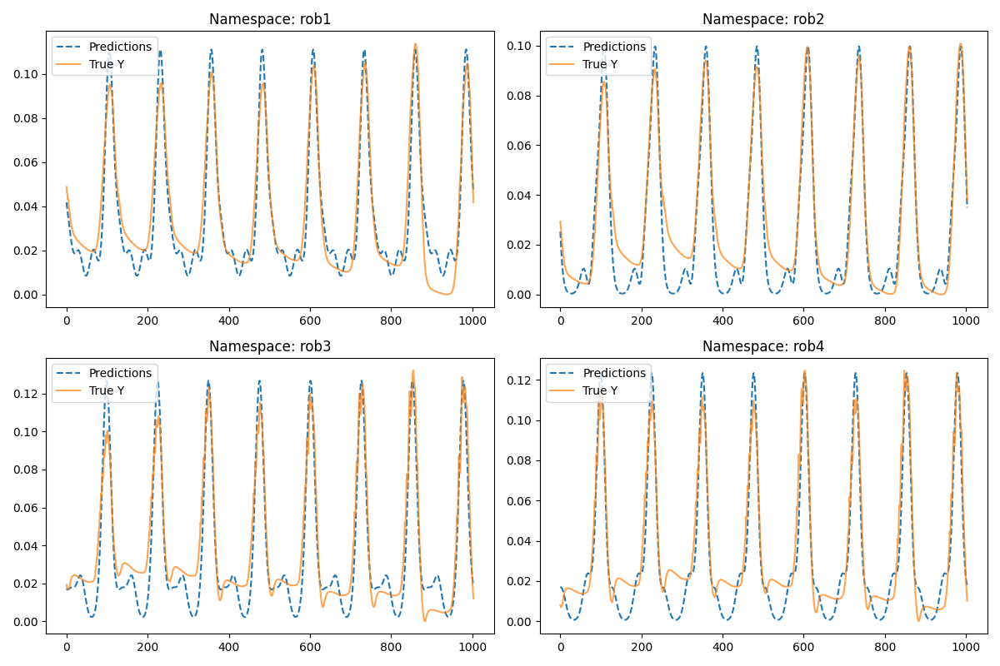
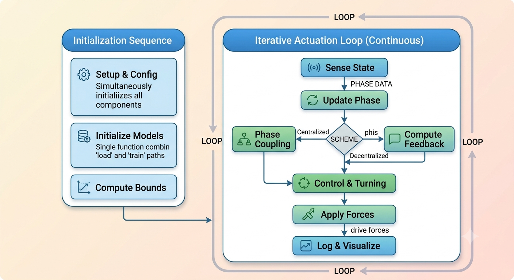
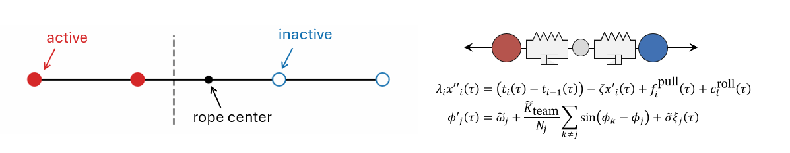
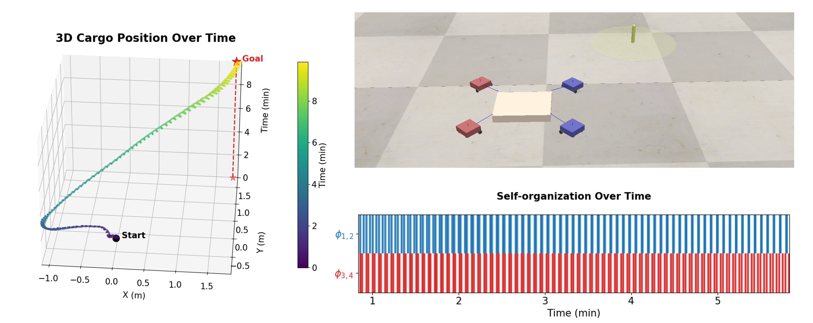
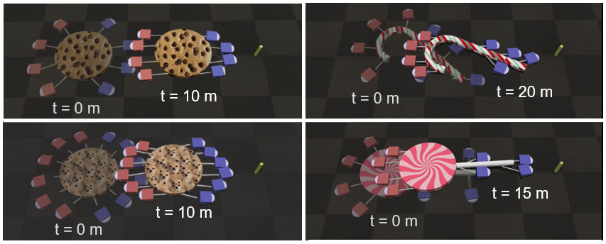
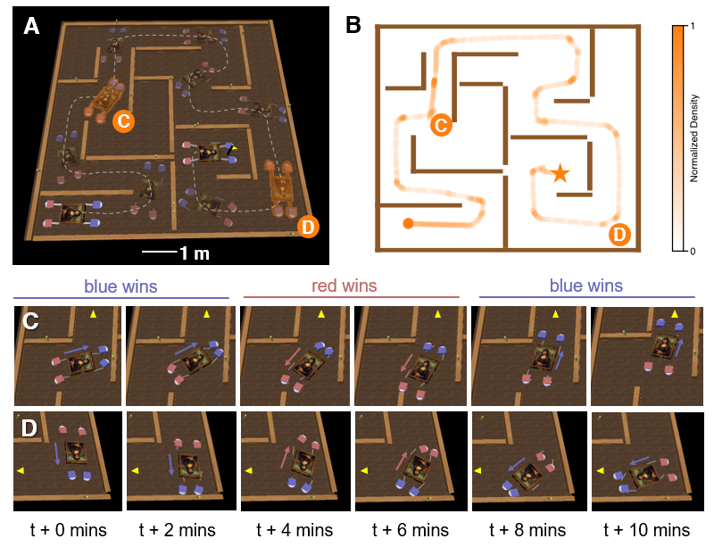
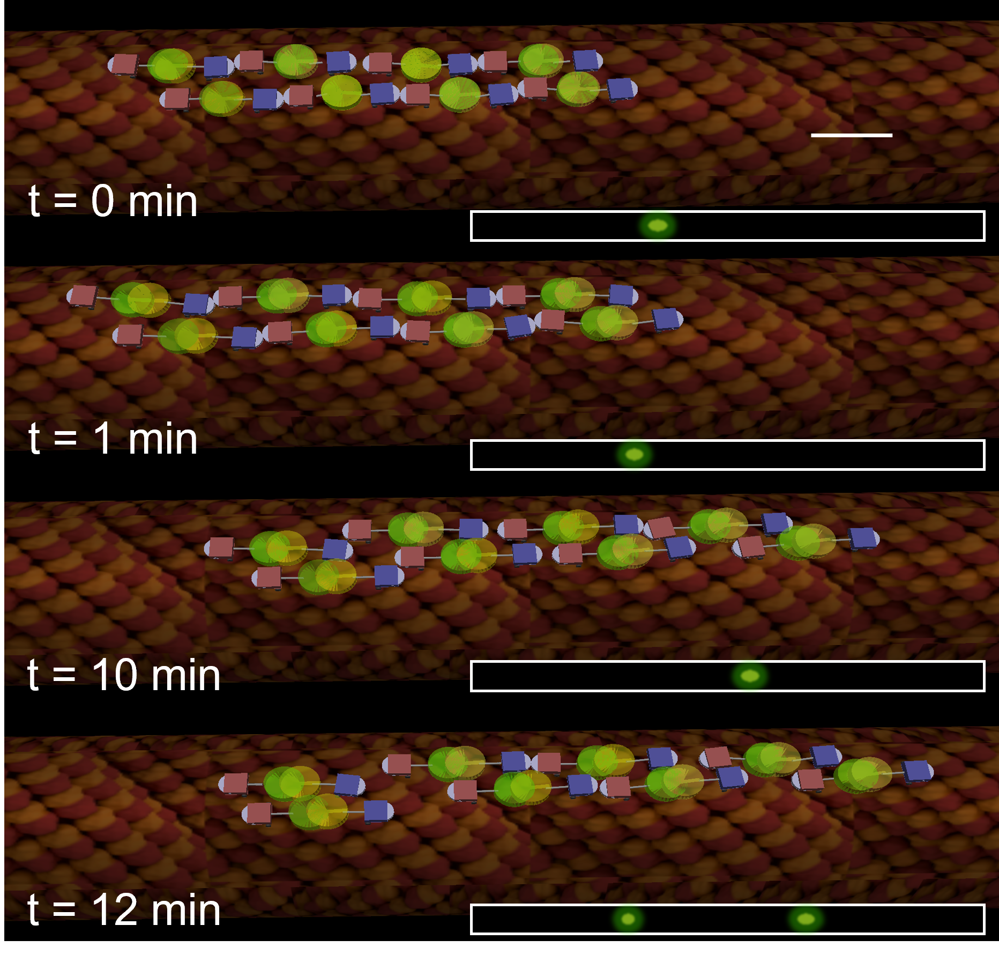

# Tug of War: How Adversarial Robots Lead to Emergent Cooperation



## Prerequisites & Requirements

- **Python**: Version 3.12
- **Python Libraries**: Standard scientific modules (`numpy`, `matplotlib`, etc.)
- **CoppeliaSim**: Version V4.4 ([Download Here](https://www.coppeliarobotics.com/))

---

## Setup Instructions

To execute Python scripts directly within CoppeliaSim:

1. Navigate to your CoppeliaSim AppData folder: `%APPDATA%/CoppeliaSim`
2. Open or create `usrset.txt`.
3. Add the `defaultPython` key pointing to your Python executable, for example:
   ```txt
   defaultPython = "C:\Users\myuser\AppData\Local\Programs\Python\Python312\python.exe"
   ```

---

## Running the Simulation

1. Open the CoppeliaSim scene: `tortel_cargoexp.ttt`
2. Open the cargo's child script and set `EXTERNAL_FILE_PATH` to point to `simtransport.py` or `multisimtransport.py`:
   ```python
   EXTERNAL_FILE_PATH = "D:/myname/projectname/simtransport.py"
   ```
3. Click the **Run** button (`>`) in CoppeliaSim. The simulator will automatically execute the Python script.

---

## Pipeline Overview



* **Phase 1 (Data Collection)**: 
  * Set `SCHEME = "kuramoto"`
  * Set `DATA_COLLECT = True`
* **Phase 2 (Pre-training)**: 
  * Set `SCHEME = "adversarial cooperation"`
  * Set `DATA_COLLECT = False`, `PLOT = True`, and `LOAD = False`
  * Rename the output data file based on target direction:
    * `bluewin_nofilter.csv` (when `DIRECTION = 1`)
    * `redwin_nofilter.csv` (when `DIRECTION = -1`)
  * Ensure the model fits the collected data properly before proceeding:

  

* **Phase 3 (Deployment)**: 
  * Set `SCHEME = "adversarial cooperation"`
  * Set `DATA_COLLECT = False`, `PLOT = True` or `False`, and `LOAD = True` (bypasses training)
  * Tune the coupling/adaptation rate (`ETA`) as needed.

---

## Architecture & Code Structure



---

## Demos & Experiments

| Demo 0: 1D Model | 
| :---: | 
|  | 

| Demo 1: Toward a Goal |
| :---: |
|  |

| Demo 3: Candy (Ant) | 
| :---: |
|  |

<table>
  <tr>
    <th style="width: 70%; text-align: center;">Demo 4: Maze (Ant)</th>
    <th style="width: 30%; text-align: center;">Demo 5: Traffic (Motor Protein)</th>
  </tr>
  <tr>
    <td style="width: 70%;text-align: center;"></td>
    <td style="width: 30%;text-align: center;"></td>
  </tr>
</table>
---

## Configuration Parameters

### Standard Configuration (`simtransport.py`)

* `SCHEME`: Control approach. Choose between:
  * `"kuramoto"`: Standard Kuramoto coupling enforcing phase offset.
  * `"adversarial cooperation"`: Implicit coupling via force feedback.
* `DIRECTION`: Target motion direction.
  * `1`: Move toward the Blue team (right).
  * `-1`: Move toward the Red team (left).

*Example*: Setting `("kuramoto", 1)` moves the collective right using explicit Kuramoto coupling. Setting `("adversarial cooperation", -1)` moves the collective left via implicit force-feedback coupling with no direct inter-robot communication.

---

### Advanced Multi-Agent Configuration (`multisimtransport.py`)

Set these parameters inside the CoppeliaSim child script:

```python
PARAMS = {
    "NPOSITIVE": 4,                        # Number of positive team robots
    "NNEGATIVE": 4,                        # Number of negative team robots
    "SCHEME": "adversarial_cooperation",   # Options: "kuramoto" vs "adversarial_cooperation"
    "DIRECTION": 1,                        # Motion direction flag (1: Blue, -1: Red)
    "ETA": 500 * 1,                        # Tegotae coupling gain
    "OMEGA": 1,                            # Natural frequency
    "LOAD": 1,                             # 1: Load pre-trained models | 0: Train
    "DATA_COLLECT": 0,                     # 1: Enable data logging | 0: Disable
}
```

---

## Contact & Contributors

* **Arthicha Srisuchinnawong**: zumoarthicha@gmail.com
* **Atanu Chatterjee**: atanu.chatterjee@colorado.edu